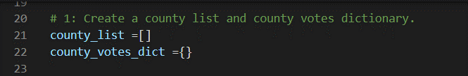
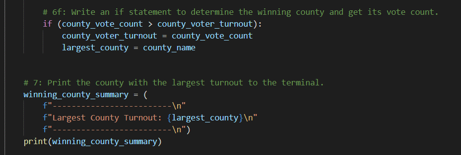
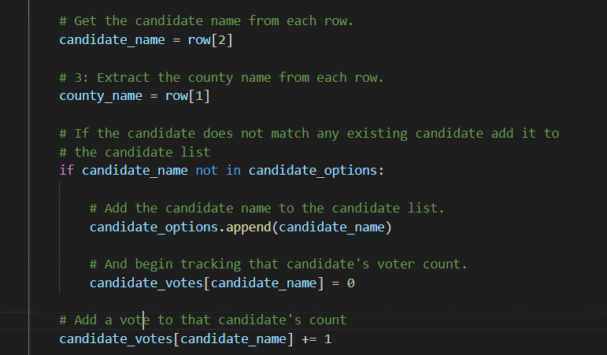

# Election Analysis

## Overview of Election Audit

### Purpose
Once the information on the votes and percentages of each candidate participating in the Election has been obtained, the commission in charge has requested additional information to complete the audit of the final results:

- The number of total votes for each county
- The percentage of votes for each county in relation to the total number of votes
- Define which was the county that had the most votes

## Election-Audit Results

**- How many votes were cast in this congressional election?**
  
  A total of 369,711 votes were obtained
 

  

  

**- Provide a breakdown of the number of votes and the percentage of total votes for each county in the precinct.**
  
  In Jefferson County, a total of 38,855 votes were obtained, which represents 10.5% of the total votes in general.

  In Denver County, a total of 306,055 votes were obtained, which represents 73.8% of the total votes in general.

  Finally, in Arapahoe County, a total of 24,801 votes were obtained, representing 6.7% of the total votes.

 

 

 

**- Which county had the largest number of votes?**

  Denver County was the place where the most votes were registered with 306,055

   

   

   

**- Provide a breakdown of the number of votes and the percentage of the total votes each candidate received.**
  
  Charles Casper Stockham registered a total of 85,213 votes, which represents 23% of the total number of votes.

  Diana DeGette obtained a total of 272,892 votes, representing 73.8% of the total number of votes.

  Finally Raymon Anthony Doane registered 11,606 which represents 3.1% of the total votes.

 

 

 

 

  

**- Which candidate won the election, what was their vote count, and what was their percentage of the total votes?**
  
  Based on the results delivered in the elections results.csv file and on the programming carried out to obtain the information on the count of the votes cast, the winning candidate was Diana DeGette with a total of 272,892 votes, which represented 73.8%. with respect to all the votes.

 

 

 
 
 

  Elections results in Command Line 

  Elections results in election_results.txt File [election_results.txt](analysis.zip).

 

## Election-Audit Summary

**- A business proposal to the election commission on how this script can be used for any election**

Give at least two examples of how this script can be modified to be used for other elections:

1. For City Council Elections, that is, so that the population can vote for mayors, we could modify the program to include the candidates, get the number and percentage of votes by municipalities, cities, counties.

2.	It can be used to elect Governors in each state, in the same way as was done in this exercise we can obtain the number of votes and percentages for each candidate, information on votes can be obtained for each county and city and with this define winners and all their quantities.

 
